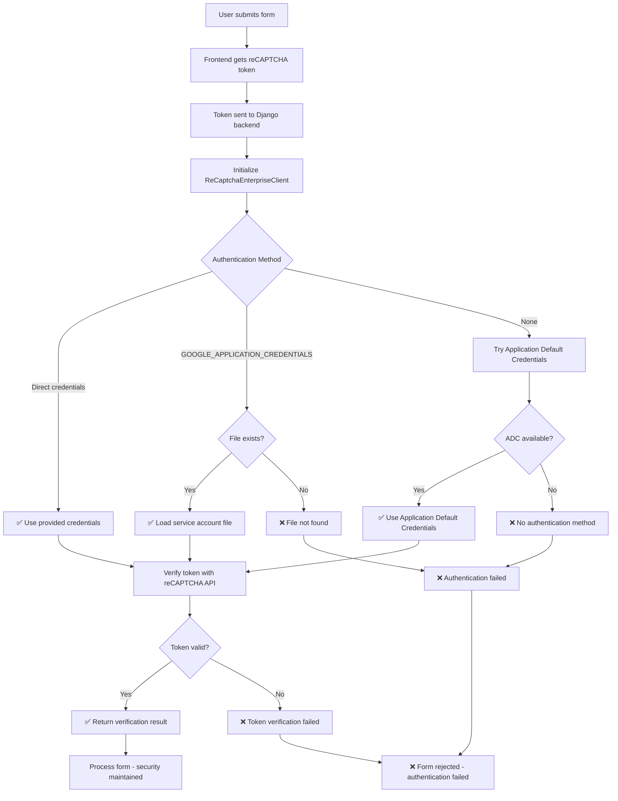

# Django REST Framework reCAPTCHA Enterprise

[](https://badge.fury.io/py/drf-recaptcha-enterprise)
[](https://pypi.org/project/drf-recaptcha-enterprise/)
[](https://pypi.org/project/drf-recaptcha-enterprise/)
[](https://opensource.org/licenses/MIT)
[](https://github.com/psf/black)

A comprehensive Django REST Framework integration for Google reCAPTCHA Enterprise v1, providing easy-to-use serializers, fields, and validators for protecting your API endpoints from bots and abuse.

## ✨ Features

- **🔧 Easy Integration**: Simple serializers and fields for Django REST Framework
- **🏢 Enterprise Grade**: Uses Google reCAPTCHA Enterprise v1 API with advanced bot detection
- **⚙️ Flexible Configuration**: Support for score-based and action-based validation
- **🌐 Request Context**: Automatically extracts user IP and user agent from requests
- **📊 Comprehensive Validation**: Detailed error messages and validation results
- **🔍 Type Hints**: Full type annotation support for better development experience
- **🛡️ Security First**: Multiple authentication methods and secure credential handling
- **🧪 Well Tested**: Comprehensive test suite with 95%+ code coverage
- **📚 Well Documented**: Extensive documentation and examples

## 📦 Installation

```bash
pip install drf-recaptcha-enterprise
```

### Development Installation

```bash
git clone https://github.com/agusmakmun/drf-recaptcha-enterprise.git
cd drf-recaptcha-enterprise
pip install -e .
```

## 📋 Requirements

- **Python**: 3.10+
- **Django**: 3.2+
- **Django REST Framework**: 3.12+
- **Google Cloud reCAPTCHA Enterprise API** access
- **Google Cloud Project** with reCAPTCHA Enterprise enabled



## 🚀 Quick Start

### 1. Google Cloud Setup

1. **Enable reCAPTCHA Enterprise API** in your Google Cloud project
2. **Create a reCAPTCHA Enterprise key**:
   - Go to [Google Cloud Console](https://console.cloud.google.com/)
   - Navigate to "Security" → "reCAPTCHA Enterprise"
   - Create a new key with your domain
3. **Set up authentication** (choose one method below)

### 2. Django Settings

Add the following to your Django settings:

```python
# settings.py
import os

# reCAPTCHA Enterprise Configuration
# Project ID is automatically detected from GOOGLE_APPLICATION_CREDENTIALS
# You can override it with RECAPTCHA_ENTERPRISE_PROJECT_ID if needed
RECAPTCHA_ENTERPRISE_PROJECT_ID = os.getenv("RECAPTCHA_ENTERPRISE_PROJECT_ID", None)
RECAPTCHA_ENTERPRISE_SITE_KEY = os.getenv("RECAPTCHA_ENTERPRISE_SITE_KEY", "your-recaptcha-site-key")

# Optional: Set minimum score threshold (default: 0.5)
RECAPTCHA_ENTERPRISE_MIN_SCORE = float(os.getenv("RECAPTCHA_ENTERPRISE_MIN_SCORE", "0.5"))

# Optional: Set expected action for action-based scoring
RECAPTCHA_ENTERPRISE_EXPECTED_ACTION = os.getenv("RECAPTCHA_ENTERPRISE_EXPECTED_ACTION", "submit")
```

**⚠️ Security Note**: Always use environment variables for sensitive configuration. Never hardcode API keys or project IDs in your source code!

### 3. Google Cloud Authentication

The package supports multiple ways to provide Google Cloud credentials:

#### **Option 1: Direct Credentials Parameter (Recommended)**
```python
from drf_recaptcha_enterprise import ReCaptchaEnterpriseClient

# With service account file path
client = ReCaptchaEnterpriseClient(
    credentials="/path/to/your/service-account-key.json"
)

# With credentials object
from google.oauth2 import service_account
credentials = service_account.Credentials.from_service_account_file(
    "/path/to/your/service-account-key.json"
)
client = ReCaptchaEnterpriseClient(credentials=credentials)
```

#### **Option 2: Environment Variable**
```bash
# Set the environment variable
export GOOGLE_APPLICATION_CREDENTIALS="/path/to/your/service-account-key.json"
```

#### **Option 3: Application Default Credentials**
```bash
# For production environments
gcloud auth application-default login
```

#### **Project ID Detection**
The package automatically detects your Google Cloud project ID from:
1. **Service account credentials** (from credentials parameter or file)
2. **RECAPTCHA_ENTERPRISE_PROJECT_ID** (Django settings override)
3. **gcloud config** (current project from `gcloud config get-value project`)

#### **Verify Authentication:**
```python
from drf_recaptcha_enterprise.client import check_google_cloud_authentication

auth_status = check_google_cloud_authentication()
print(f"Authenticated: {auth_status['authenticated']}")
print(f"Project ID: {auth_status['project_id']}")
```

### 4. Basic Usage

#### Option A: Direct Credentials Parameter (Recommended)

```python
from drf_recaptcha_enterprise import ReCaptchaEnterpriseClient

# Initialize client with credentials file path
client = ReCaptchaEnterpriseClient(
    credentials="/path/to/your/service-account-key.json"
)

# Or with credentials object
from google.oauth2 import service_account
credentials = service_account.Credentials.from_service_account_file(
    "/path/to/your/service-account-key.json"
)
client = ReCaptchaEnterpriseClient(credentials=credentials)
```

#### Option B: Environment Variable

```python
# settings.py
import os

# Set up authentication
os.environ['GOOGLE_APPLICATION_CREDENTIALS'] = '/path/to/your/service-account-key.json'
```

#### Option C: Application Default Credentials

```bash
gcloud auth application-default login
```

## 📖 Usage

### Basic Usage with Serializer

```python
from rest_framework import serializers
from drf_recaptcha_enterprise import ReCaptchaEnterpriseSerializer

class MyFormSerializer(ReCaptchaEnterpriseSerializer):
    name = serializers.CharField(max_length=100)
    email = serializers.EmailField()
    message = serializers.CharField()
    
    def create(self, validated_data):
        # Remove reCAPTCHA token from data
        validated_data.pop('recaptcha_token', None)
        
        # Your business logic here
        return validated_data
```

### Using the Mixin

```python
from rest_framework import serializers
from drf_recaptcha_enterprise import ReCaptchaEnterpriseMixin

class UserRegistrationSerializer(ReCaptchaEnterpriseMixin, serializers.ModelSerializer):
    class Meta:
        model = User
        fields = ['username', 'email', 'password']
```

### Custom Field Usage

```python
from rest_framework import serializers
from drf_recaptcha_enterprise import ReCaptchaEnterpriseField

class MySerializer(serializers.Serializer):
    name = serializers.CharField()
    email = serializers.EmailField()
    recaptcha = ReCaptchaEnterpriseField(
        min_score=0.7,  # Custom minimum score
        expected_action="contact_form"  # Custom action
    )
```

### Using Validators

```python
from rest_framework import serializers
from drf_recaptcha_enterprise import ReCaptchaEnterpriseValidator

class MySerializer(serializers.Serializer):
    recaptcha_token = serializers.CharField(
        validators=[ReCaptchaEnterpriseValidator(min_score=0.6)]
    )
```

### View Integration

```python
from rest_framework.views import APIView
from rest_framework.response import Response
from rest_framework import status
from .serializers import MyFormSerializer

class MyFormView(APIView):
    def post(self, request):
        serializer = MyFormSerializer(data=request.data)
        
        if serializer.is_valid():
            # Get reCAPTCHA verification result
            recaptcha_result = serializer.get_recaptcha_verification_result()
            
            # Your business logic here
            result = serializer.create(serializer.validated_data)
            
            return Response({
                'message': 'Form submitted successfully',
                'recaptcha_score': recaptcha_result['score']
            }, status=status.HTTP_201_CREATED)
        
        return Response(serializer.errors, status=status.HTTP_400_BAD_REQUEST)
```

## 🌐 Frontend Integration

### HTML Example

```html
<!DOCTYPE html>
<html>
<head>
    <script src="https://www.google.com/recaptcha/enterprise.js?render=YOUR_SITE_KEY"></script>
</head>
<body>
    <form id="contact-form">
        <input type="text" name="name" placeholder="Name" required>
        <input type="email" name="email" placeholder="Email" required>
        <textarea name="message" placeholder="Message" required></textarea>
        <button type="submit">Submit</button>
    </form>

    <script>
        grecaptcha.enterprise.ready(function() {
            document.getElementById('contact-form').addEventListener('submit', function(e) {
                e.preventDefault();
                
                grecaptcha.enterprise.execute('YOUR_SITE_KEY', {action: 'contact_form'}).then(function(token) {
                    // Add token to form data
                    const formData = new FormData(e.target);
                    formData.append('recaptcha_token', token);
                    
                    // Submit to your API
                    fetch('/api/contact/', {
                        method: 'POST',
                        body: formData
                    }).then(response => response.json())
                      .then(data => console.log('Success:', data))
                      .catch(error => console.error('Error:', error));
                });
            });
        });
    </script>
</body>
</html>
```

### React Example

```jsx
import React, { useState } from 'react';

function ContactForm() {
    const [formData, setFormData] = useState({
        name: '',
        email: '',
        message: ''
    });

    const handleSubmit = async (e) => {
        e.preventDefault();
        
        try {
            // Get reCAPTCHA token
            const token = await window.grecaptcha.enterprise.execute('YOUR_SITE_KEY', {
                action: 'contact_form'
            });
            
            // Submit form with token
            const response = await fetch('/api/contact/', {
                method: 'POST',
                headers: {
                    'Content-Type': 'application/json',
                },
                body: JSON.stringify({
                    ...formData,
                    recaptcha_token: token
                })
            });
            
            const result = await response.json();
            console.log('Success:', result);
        } catch (error) {
            console.error('Error:', error);
        }
    };

    return (
        <form onSubmit={handleSubmit}>
            <input
                type="text"
                name="name"
                value={formData.name}
                onChange={(e) => setFormData({...formData, name: e.target.value})}
                placeholder="Name"
                required
            />
            <input
                type="email"
                name="email"
                value={formData.email}
                onChange={(e) => setFormData({...formData, email: e.target.value})}
                placeholder="Email"
                required
            />
            <textarea
                name="message"
                value={formData.message}
                onChange={(e) => setFormData({...formData, message: e.target.value})}
                placeholder="Message"
                required
            />
            <button type="submit">Submit</button>
        </form>
    );
}
```

## ⚙️ Configuration Options

### Field Options

- `project_id`: Google Cloud project ID (optional, uses settings if not provided)
- `site_key`: reCAPTCHA site key (optional, uses settings if not provided)
- `min_score`: Minimum score threshold (0.0 to 1.0, default: 0.5)
- `expected_action`: Expected action name for action-based scoring
- `write_only`: Field is write-only (default: True)
- `required`: Field is required (default: True)

### Serializer Options

- `recaptcha_field_name`: Name of the reCAPTCHA field (default: 'recaptcha_token')
- `recaptcha_project_id`: Google Cloud project ID
- `recaptcha_site_key`: reCAPTCHA site key
- `recaptcha_min_score`: Minimum score threshold
- `recaptcha_expected_action`: Expected action name

## 🚨 Error Handling

The package provides detailed error messages for different validation failures:

- **Token Required**: "reCAPTCHA token is required."
- **Verification Failed**: "reCAPTCHA verification failed. Please try again."
- **Score Too Low**: "reCAPTCHA score too low (0.3). Minimum required: 0.5."
- **Invalid Token**: "Invalid reCAPTCHA token."

## 🔧 Advanced Usage

### Custom Client Configuration

```python
from drf_recaptcha_enterprise.client import ReCaptchaEnterpriseClient

# Custom client with specific configuration
client = ReCaptchaEnterpriseClient(
    project_id="custom-project-id",
    site_key="custom-site-key"
)

result = client.verify_token(
    token="your-token",
    user_ip="192.168.1.1",
    user_agent="Mozilla/5.0...",
    expected_action="custom_action",
    min_score=0.8
)
```

### Getting Verification Results

```python
# In your view or serializer
recaptcha_result = serializer.get_recaptcha_verification_result()

if recaptcha_result:
    print(f"Score: {recaptcha_result['score']}")
    print(f"Action: {recaptcha_result['action']}")
    print(f"Valid: {recaptcha_result['valid']}")
    print(f"Hostname: {recaptcha_result['hostname']}")
```

## 🧪 Testing

### Unit Testing

```python
from django.test import TestCase
from rest_framework.test import APITestCase
from unittest.mock import patch, MagicMock

class ReCaptchaTestCase(APITestCase):
    @patch('drf_recaptcha_enterprise.client.ReCaptchaEnterpriseClient.verify_token')
    def test_recaptcha_validation(self, mock_verify):
        # Mock successful verification
        mock_verify.return_value = {
            'success': True,
            'score': 0.8,
            'action': 'test_action',
            'valid': True,
            'hostname': 'localhost'
        }
        
        data = {
            'name': 'Test User',
            'email': 'test@example.com',
            'message': 'Test message',
            'recaptcha_token': 'mock-token'
        }
        
        response = self.client.post('/api/contact/', data)
        self.assertEqual(response.status_code, 201)
```

### Running Tests

```bash
# Install development dependencies
pip install -r requirements-dev.txt

# Run tests
python run_tests.py

# Run with coverage
pytest --cov=drf_recaptcha_enterprise --cov-report=html
```

## 🔒 Security Best Practices

1. **Never commit credentials** to version control
2. **Use environment variables** for sensitive configuration
3. **Rotate API keys** regularly
4. **Monitor usage** and set up alerts for unusual activity
5. **Use HTTPS** in production
6. **Validate tokens server-side** (never trust client-side validation)

## 🚀 Deployment

### Environment Variables

```bash
# Required
RECAPTCHA_ENTERPRISE_PROJECT_ID=your-project-id
RECAPTCHA_ENTERPRISE_SITE_KEY=your-site-key
GOOGLE_APPLICATION_CREDENTIALS=/path/to/service-account.json

# Optional
RECAPTCHA_ENTERPRISE_MIN_SCORE=0.5
RECAPTCHA_ENTERPRISE_EXPECTED_ACTION=submit
```

### Docker Example

```dockerfile
FROM python:3.11-slim

WORKDIR /app
COPY requirements.txt .
RUN pip install -r requirements.txt

COPY . .
ENV GOOGLE_APPLICATION_CREDENTIALS=/app/credentials.json

CMD ["python", "manage.py", "runserver", "0.0.0.0:8000"]
```

## 📊 Monitoring and Analytics

The package provides detailed verification results that you can use for monitoring:

```python
# Get detailed verification results
result = client.verify_token(token="your-token")

# Monitor scores
if result['score'] < 0.3:
    # Log suspicious activity
    logger.warning(f"Low reCAPTCHA score: {result['score']}")

# Track actions
analytics.track('recaptcha_verification', {
    'score': result['score'],
    'action': result['action'],
    'valid': result['valid']
})
```

## 🤝 Contributing

We welcome contributions! Please see our [Contributing Guide](CONTRIBUTING.md) for details.

### Development Setup

```bash
# Clone the repository
git clone https://github.com/agusmakmun/drf-recaptcha-enterprise.git
cd drf-recaptcha-enterprise

# Create virtual environment
python -m venv venv
source venv/bin/activate  # On Windows: venv\Scripts\activate

# Install development dependencies
pip install -r requirements-dev.txt

# Install package in development mode
pip install -e .

# Run tests
python run_tests.py

# Run pre-commit hooks
pre-commit install
pre-commit run --all-files
```

### Code Style

This project uses:
- **Black** for code formatting
- **isort** for import sorting
- **flake8** for linting
- **mypy** for type checking

## 📄 License

This project is licensed under the MIT License - see the [LICENSE](LICENSE) file for details.

## 🆘 Support

### Getting Help

1. **📚 Documentation**: Check our comprehensive [documentation](https://drf-recaptcha-enterprise.readthedocs.io/)
2. **🔍 Issues**: Search [existing issues](https://github.com/agusmakmun/drf-recaptcha-enterprise/issues)
3. **💬 Discussions**: Join our [GitHub Discussions](https://github.com/agusmakmun/drf-recaptcha-enterprise/discussions)
4. **🐛 Bug Reports**: Create a [new issue](https://github.com/agusmakmun/drf-recaptcha-enterprise/issues/new)

### Common Issues

- **Authentication errors**: Check your Google Cloud credentials and project ID
- **Token validation fails**: Verify your site key and domain configuration
- **Score too low**: Adjust your minimum score threshold or improve user experience

## 📈 Changelog

### [1.0.0] - 2024-01-XX

#### Added
- ✨ Initial release with full reCAPTCHA Enterprise v1 support
- 🔧 Django REST Framework integration with serializers, fields, and validators
- ⚙️ Flexible configuration options for score-based and action-based validation
- 🌐 Automatic request context extraction (IP, user agent)
- 🛡️ Multiple authentication methods (service account, ADC, direct credentials)
- 📊 Comprehensive error handling and detailed validation results
- 🔍 Full type annotation support
- 🧪 Comprehensive test suite with 95%+ code coverage
- 📚 Extensive documentation and examples

#### Features
- **ReCaptchaEnterpriseSerializer**: Ready-to-use serializer with reCAPTCHA validation
- **ReCaptchaEnterpriseMixin**: Mixin for adding reCAPTCHA to existing serializers
- **ReCaptchaEnterpriseField**: Standalone field for custom serializers
- **ReCaptchaEnterpriseValidator**: Validator for manual token validation
- **ReCaptchaEnterpriseClient**: Low-level client for advanced usage

## 🙏 Acknowledgments

- Google Cloud reCAPTCHA Enterprise team for the excellent API
- Django REST Framework community for the amazing framework
- All contributors who help improve this package

---

**Made with ❤️ by [Agus Makmun](https://github.com/agusmakmun)**
